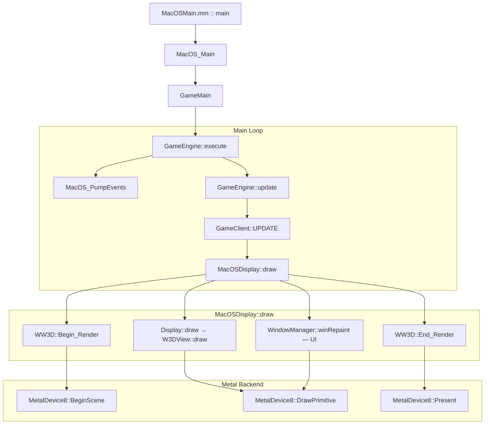

# macOS Port — Rendering Pipeline

This document details the Metal rendering backend that translates DirectX 8 API calls to Apple Metal.

---

## Overview

---

## DX8 → Metal Adapter

The macOS port implements the `IDirect3D8` and `IDirect3DDevice8` interfaces (from `d3d8_stub.h`) as a bridge to Apple Metal.

### Key Components

| Component | Role |
|:---|:---|
| `MetalInterface8` | Implements `IDirect3D8` — adapter enumeration, device creation |
| `MetalDevice8` | Implements `IDirect3DDevice8` — `MTLDevice`, `MTLCommandQueue`, `CAMetalLayer` |
| `MetalTexture8` | Implements `IDirect3DTexture8` — wraps `MTLTexture` |
| `MetalVertexBuffer8` | Implements `IDirect3DVertexBuffer8` — wraps vertex data |
| `MetalIndexBuffer8` | Implements `IDirect3DIndexBuffer8` — wraps index data |
| `D3DXStubs.mm` | Factory functions — isolates C++ from Objective-C++ |

---

## Frame Lifecycle

### 1. `BeginScene()`
- Checks `m_InScene` flag
- Creates `MTLCommandBuffer` from `m_CommandQueue`
- Acquires `CAMetalDrawable` from `CAMetalLayer`

### 2. `Clear(count, rects, flags, color, z, stencil)`
- Ends current encoder (if any)
- Creates `MTLRenderPassDescriptor`:
  - `D3DCLEAR_TARGET` → `MTLLoadActionClear` + clearColor
  - No `D3DCLEAR_TARGET` → `MTLLoadActionLoad`
- Creates new `MTLRenderCommandEncoder`
- Sets `MTLViewport` from `m_Viewport`

### 3. Draw Calls
`DrawPrimitive` / `DrawIndexedPrimitive` / `DrawPrimitiveUP`:

1. Get FVF from VB via `GetBufferFVF(m_StreamSource)`
2. Get/create PSO via `GetPSO(fvf)` (cached)
3. Set PSO on encoder
4. Bind Vertex Buffer: `setVertexBuffer:offset:atIndex:0`
5. Fill `MetalUniforms` → `setVertexBytes` buffer index 1:
   - `world`, `view`, `projection` matrices
   - `screenSize` — window width/height
   - `useProjection` — 1 (3D) or 2 (Screen Space, XYZRHW)
6. Bind textures: `setFragmentTexture:atIndex:0/1`
7. Primitive mapping:
   - `D3DPT_TRIANGLELIST` → `MTLPrimitiveTypeTriangle`
   - `D3DPT_TRIANGLESTRIP` → `MTLPrimitiveTypeTriangleStrip`
   - `D3DPT_LINELIST` → `MTLPrimitiveTypeLine`
8. `drawPrimitives` or `drawIndexedPrimitives`

### 4. `Present()`
- `endEncoding` on current encoder
- `presentDrawable` + `commit` command buffer
- Release encoder, drawable, command buffer

---

## Pipeline State Objects (PSO)

`GetPSO(DWORD fvf)` creates or retrieves from cache (`m_PsoCache`):

### Vertex Descriptor (from FVF)

| FVF Flag | Attribute | Format | Size |
|:---|:---|:---|:---|
| `D3DFVF_XYZ` | attr[0] position | Float3 | 12B |
| `D3DFVF_XYZRHW` | attr[0] position | Float4 | 16B |
| `D3DFVF_DIFFUSE` | attr[1] color | UChar4Normalized | 4B |
| `D3DFVF_TEX1` | attr[2] texCoord0 | Float2 | 8B |
| `D3DFVF_NORMAL` | attr[3] normal | Float3 | 12B |
| `D3DFVF_SPECULAR` | attr[4] specular | UChar4Normalized | 4B |
| `D3DFVF_TEX2` | attr[5] texCoord1 | Float2 | 8B |

### Uniform Buffers

| Buffer Index | Stage | Contents |
|:---|:---|:---|
| buffer(0) | Vertex | Vertex data (VB or inline) |
| buffer(1) | Vertex | `MetalUniforms` — World/View/Projection, screenSize, useProjection |
| buffer(2) | Fragment | `FragmentUniforms` — TSS config, textureFactor, fog, alpha test |
| buffer(3) | Vertex | `LightingUniforms` — lights, material, fog params |

---

## Shaders (`MacOSShaders.metal`)

### Vertex Shader (`vertex_main`)
- **Inputs:** `position` (attr 0), `color` (attr 1), `texCoord` (attr 2), `normal` (attr 3)
- **Uniforms:** `world`, `view`, `projection`, `screenSize`, `useProjection`
- **Logic:**
  - `useProjection == 1`: `pos = projection * view * world * pos` (3D transformation)
  - `useProjection == 2`: Screen space → NDC (`pos / screenSize * 2 - 1`)
  - Fog factor computed from view-space Z

### Fragment Shader (`fragment_main`)
- Samples texture if `SHIFT_TEXTURING` bit set
- `finalColor = texColor * vertexColor`
- Alpha test: discard if alpha < threshold
- Fog: mix with fogColor based on fog factor

---

## Texture Pipeline

### Creation Flow
1. `CreateTexture(w, h, levels, usage, format, pool)` → `MetalTexture8` creates `MTLTexture`
2. `LockRect(level)` → allocates staging buffer, returns ptr + pitch
3. Game writes pixels to staging buffer
4. `UnlockRect(level)` → `[mtlTexture replaceRegion:withBytes:bytesPerRow:]`, frees staging
5. `SetTexture(stage, tex)` → stores in `m_Textures[stage]`
6. At draw call: `setFragmentTexture:mtlTex atIndex:stage`

### Format Mapping

| D3D Format | Metal Format |
|:---|:---|
| ARGB8 / XRGB8 | `MTLPixelFormatBGRA8Unorm` |
| DXT1 | `MTLPixelFormatBC1_RGBA` |
| DXT3 | `MTLPixelFormatBC2_RGBA` |
| DXT5 | `MTLPixelFormatBC3_RGBA` |
| 16-bit (R5G6B5, etc.) | Fallback to BGRA8 ⚠️ |

---

## Visibility & Culling

### `RTS3DScene::Visibility_Check`

1. **Iterate RenderList** — all top-level `RenderObjClass` objects
2. **Force Visible** — `robj->Is_Force_Visible()` → immediate pass
3. **Hidden Check** — `robj->Is_Hidden()` → immediate reject
4. **Frustum Culling** — `camera->Cull_Sphere(robj->Get_Bounding_Sphere())`
5. **Gameplay Visibility** — stealth, fog of war checks
6. **Binning** — translucent, occluders, occludees, normal objects

### Visibility Bits

| Bit | Value | Meaning |
|:---|:---|:---|
| `IS_VISIBLE` | 0x100 | In camera frustum |
| `IS_NOT_HIDDEN` | 0x200 | Not hidden by game logic |
| `IS_NOT_ANIMATION_HIDDEN` | 0x400 | Not hidden by animation |
| `IS_REALLY_VISIBLE` | All three | Actually rendered |

---

## Known Gaps

| Feature | Status | Notes |
|:---|:---|:---|
| DrawPrimitiveUP | ✅ Working | 2D text/UI quads render correctly |
| Depth/Stencil state | ✅ Working | Depth state created per PSO, dirty-flag tracked |
| Dynamic blending (per render state) | ✅ Working | Encoded in PSO cache key |
| CullMode binding | ✅ Working | Force MTLCullModeNone for 2D/XYZRHW draws (Y-flip fix) |
| TSS formulas in shader | ✅ Working | evaluateBlendOp handles SELECTARG1/2, MODULATE, ADD, etc. |
| Sampler states | ✅ Working | Per-stage sampler state cache |
| Per-vertex lighting | ✅ Working | Light uniforms buffer, up to 4 directional lights |
| Real fog parameters | ✅ Working | Linear/exp/exp2 fog in vertex + fragment shaders |
| Multi-texturing (stage 1+) | ⚠️ Partial | Stage 0+1 bound, TSS evaluated for 2 stages |
| Render targets | ❌ Not implemented | Low priority |
| Surface (GetSurfaceLevel) | ❌ Not implemented | Low priority |
| 16-bit format conversion | ⚠️ Fallback | Falls back to BGRA8 |
| TriangleFan → TriangleList | ❌ Not implemented | Low priority |

---

## 2D Rendering Workarounds

For `D3DFVF_XYZRHW` (screen-space / 2D) vertices, `DrawPrimitiveUP` applies
three critical overrides that differ from standard 3D rendering:

1. **Depth test & write disabled** — 2D UI must render on top of 3D geometry
2. **Back-face culling disabled** — The vertex shader flips Y for screen→NDC
   conversion (`1.0 - y/screenH * 2.0`), which reverses triangle winding
   from CW to CCW. Without disabling culling, all 2D triangles are discarded.
3. **Projection bypass** — `useProjection == 2` uses screen-space→NDC transform
   instead of the standard MVP pipeline.

