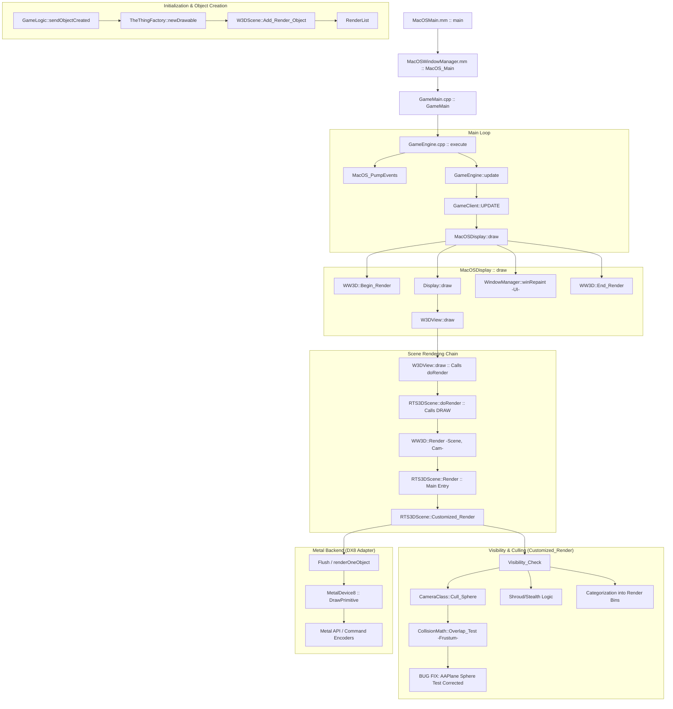

# Rendering Flow (macOS/Metal)

This document maps the rendering lifecycle from high-level engine logic down to low-level Metal API calls.

## Overview Flow



## Metal DirectX 8 Adapter (Stage 0)

The macOS port uses a direct implementation of the `IDirect3D8` and `IDirect3DDevice8` interfaces (defined in `d3d8_stub.h`) to bridge the engine's legacy calls to the Apple Metal API.

### Key Components

- **`MetalInterface8`**: Implements `IDirect3D8`. Handles adapter enumeration and device creation.
- **`MetalDevice8`**: Implements `IDirect3DDevice8`. Manages `MTLDevice`, `MTLCommandQueue`, and the `CAMetalLayer`.
- **`D3DXStubs.cpp`**: Contains `extern "C"` factory functions to create these objects, isolating C++ from Objective-C++ where possible.

### `win_compat.h` / Metal Isolation

To avoid naming conflicts between Windows API stubs in `win_compat.h` and macOS system headers (e.g., `LoadResource`, `GetCurrentThread`), the following patterns are used:

1.  **Opaque Pointers**: `MetalDevice8.h` uses `void*` for all Metal/ObjC types to avoid importing `<Metal/Metal.h>` in the header.
2.  **Import Order**: In `.mm` files, macOS framework headers are imported **before** any headers that include `win_compat.h`.
3.  **Conditional Guards**: Conflicting functions in `win_compat.h` are wrapped in `#if !defined(__OBJC__)`.

### Frame Lifecycle in `MetalDevice8`

1.  **`BeginScene`**: Acquires the next `id<CAMetalDrawable>` and creates a `id<MTLCommandBuffer>`.
2.  **`Clear`**: Ends the current encoder (if any) and creates a new `MTLRenderCommandEncoder` with clear actions. Depth attachment (`Depth32Float`) is bound to the render pass.
3.  **`DrawPrimitive` / `DrawIndexedPrimitive` / `DrawPrimitiveUP`**: Full per-draw pipeline:
    - **PSO**: Fetched from cache (key = FVF + blend/depth/cull state). Created lazily.
    - **Vertex Descriptor** (from FVF):
      - `attribute(0)`: position — `Float3` (3D) or `Float4` (XYZRHW)
      - `attribute(1)`: diffuse color — `UChar4Normalized` (BGRA)
      - `attribute(2)`: texCoord0 — `Float2`
      - `attribute(3)`: normal — `Float3`
      - `attribute(4)`: specular color — `UChar4Normalized` (BGRA)
      - `attribute(5)`: texCoord1 — `Float2` (multi-texturing)
    - **Uniform Buffers**:
      - `buffer(0)`: Vertex data (VB or inline via setVertexBytes)
      - `buffer(1)`: `MetalUniforms` — World/View/Projection matrices, screenSize, useProjection
      - `buffer(2)` (fragment): `FragmentUniforms` — TSS config, textureFactor, fog, alpha test
      - `buffer(3)` (vertex): `LightingUniforms` — lights, material, fog params for vertex fog
    - **Textures/Samplers**: `tex0`/`tex1` + `sampler0`/`sampler1` bound per stage
    - **Depth/Stencil**: `MTLDepthStencilState` from cache (key = zEnable|zWrite|zFunc)
    - **Cull/Fill**: Applied via `ApplyPerDrawState()`
4.  **`Present`**: Commits the command buffer and presents the drawable.

## 🔴 Current Debug State (2026-02-18)

The full rendering pipeline IS flowing, but the screen remains dark. Confirmed via trace logging:

### What WORKS ✅
| Component | Evidence |
|:---|:---|
| `MacOSDisplay::draw()` | Called every frame, heartbeat confirmed |
| `WW3D::Begin_Render` → `Clear()` → `BeginScene()` | BeginScene acquires drawable, Clear creates encoder with `MTLLoadActionClear` |
| `winRepaint()` → `drawWindow()` → `W3DGameWinDefaultDraw` | Called, invokes `TheDisplay->drawFillRect()` |
| `W3DDisplay::drawFillRect` → `Render2DClass::Render()` | **2500+ calls/session.** `Indices=6, Verts=4` per call (1 quad). NOT early-returning. |
| `Render2DClass::Render()` → `DX8Wrapper::Draw_Triangles()` | Draw calls pass through to `MetalDevice8::DrawIndexedPrimitive` |
| `Present()` | Called every frame (confirmed). Commits command buffer + presents drawable. |

### What's BROKEN ❌
- **Nothing is visible on screen.** All rects drawn are invisible.
- Render2D uses `D3DFVF_XYZRHW` (pretransformed, screen-space) vertices with `Tex=0x0` (no texture, color-only fills).
- Vertex shader must convert XYZRHW pixel coords → Metal NDC `[-1,1]`. If this transform is wrong, triangles are clipped or drawn off-screen.
- Key path: `Render2DClass::Render()` calls `Set_World_Identity()` / `Set_View_Identity()` / `Set_Transform(PROJECTION, identity)` — so the shader must use `useProjection=2` (XYZRHW) path.

### Rendering Call Chain (UI)
```
GameWindowManager::winFillRect(color, width, x1, y1, x2, y2)
  → TheDisplay->drawFillRect(x1, y1, w, h, color)          // GameWindowGlobal.cpp:92
    → m_2DRender->Reset()                                    // W3DDisplay.cpp:2235
    → m_2DRender->Enable_Texturing(FALSE)
    → m_2DRender->Add_Rect(RectClass(...), 0, 0, color)
    → m_2DRender->Render()                                   // render2d.cpp:592
      → DynamicVBAccessClass vb(DYNAMIC_DX8, fvf, 4)        // XYZRHW|DIFFUSE|TEX1
      → DynamicIBAccessClass ib(DYNAMIC_DX8, 6)
      → DX8Wrapper::Set_Shader(Shader)
      → DX8Wrapper::Draw_Triangles(0, 2, 0, 4)
        → DX8Wrapper::Draw(D3DPT_TRIANGLELIST, 0, 2, 0, 4)
          → Apply_Render_State_Changes()
          → MetalDevice8::DrawIndexedPrimitive(pt, 0, 4, 0, 2)
```


## Detailed Visibility Check (`RTS3DScene::Visibility_Check`)

Located in `GeneralsMD/Code/GameEngineDevice/Source/W3DDevice/GameClient/W3DScene.cpp`.

1.  **Iterate `RenderList`**: Loops through all top-level `RenderObjClass` objects.
2.  **Force Visible**: If `robj->Is_Force_Visible()`, object is marked visible immediately.
3.  **Hidden Check**: If `robj->Is_Hidden()`, object is marked invisible.
4.  **Frustum Culling**: `bool isVisible = !camera->Cull_Sphere(robj->Get_Bounding_Sphere())`.
    *   **Frustum Normals**: The 6 planes of the frustum are oriented with normals pointing **OUTWARD** (defined in `FrustumClass::Init`).
    *   **Overlap Mapping**: Vegas math uses a specific mapping for `CollisionMath::OverlapType`:
        *   `POS` (0x01) == `OUTSIDE` (Positive half-space relative to outward normal).
        *   `NEG` (0x02) == `INSIDE` (Negative half-space, inside the frustum).
    *   **Logic**: An object is rejected (`OUTSIDE`) if its bounding sphere is entirely in the `POS` half-space of *any* frustum plane.
5.  **Gameplay Visibility**:
    *   `draw->isDrawableEffectivelyHidden()`: Check for stealth/special states.
    *   `draw->getFullyObscuredByShroud()`: Check if under fog of war.
6.  **Binning (Categorization)**:
    *   **Translucent**: Added to `m_translucentObjectsBuffer`.
    *   **Occluders**: Structures added to `m_potentialOccluders`.
    *   **Occludees**: Units/Objects that can be hidden behind buildings (`m_potentialOccludees`).
    *   **Normal**: Everything else added to `m_nonOccludersOrOccludee`.

## Visibility States & Bits (`RenderObjClass`)

The final visibility is a bitwise combination of states defined in `Core/Libraries/Source/WWVegas/WW3D2/rendobj.h`:

*   `IS_VISIBLE` (0x100): Set by `Visibility_Check` if the object's sphere is inside the camera frustum.
*   `IS_NOT_HIDDEN` (0x200): Set by `Set_Hidden(false)`. Represents gameplay-level visibility (e.g., script-hidden).
*   `IS_NOT_ANIMATION_HIDDEN` (0x400): Managed by the animation system.
*   **`IS_REALLY_VISIBLE`**: A macro combining all three: `IS_VISIBLE | IS_NOT_HIDDEN | IS_NOT_ANIMATION_HIDDEN`.

**Logic Flow**:
1.  `Visibility_Check` sets/clears the `IS_VISIBLE` bit based on frustum.
2.  `Customized_Render` calls `robj->Is_Really_Visible()`.
3.  If any bit is missing (e.g., object is in frustum but hidden by script), it won't be rendered.

## Hierarchical Culling (AABTree)

Before the per-object `Visibility_Check`, the engine uses an `AABTreeCullSystemClass` to reject entire branches of objects.
*   Uses `AAPlaneClass` (Axis-Aligned Planes) for fast intersection tests.
*   *Bug Note*: Corrected `AAPlaneClass` sphere overlap test directly improves AABTree culling accuracy.

## Shadow Lifecycle

Shadows are handled in `W3DScene::Flush` (before rendering objects) and during `renderOneObject`.

1.  **`PrepareShadows()`**: Called at the start of `Flush`.
2.  **`W3DVolumetricShadow::Update()`**: 
    *   Determines if shadow needs rebuild (position/light change).
    *   Checks if shadow center is within the "visible universe" bounding box.
3.  **`W3DVolumetricShadowManager::renderShadows()`**:
    *   Sets up Stencil states for shadow volumes.
    *   Renders volumes into Stencil buffer (Z-Pass/Z-Fail algorithms).
    *   Masks out areas with occluded player colors (to avoid drawing shadows on "ghost" silhouettes).

## Null Safety During Shell Phase (macOS-specific)

On macOS, several game globals (`TheGameLogic`, `TheInGameUI`, `TheTacticalView`, `TheScriptEngine`, `TheTerrainVisual`) may not be initialized when the shell/menu UI begins processing events. Additionally, `TheTerrainVisual` is explicitly set to `nullptr` after its `init()` throws `ERROR_BUG` (memory pool issue with `HeightMapRenderObjClass`).

### Affected Call Paths (Fixed)

| Crash Location | Root Cause | Fix |
|:---|:---|:---|
| `W3DView::getPickRay` | `m_3DCamera` null | Added null check, return zero ray |
| `W3DView::getAxisAlignedViewRegion` | UB `if (this == nullptr)` optimized away | Removed UB check; `getPickRay` now safe |
| `InGameUI::areTooltipsDisabled` | `TheGameLogic->getFrame()` with null `TheGameLogic` | Guard returns `FALSE` |
| `ControlBar::showBuildTooltipLayout` | `TheInGameUI` / `TheScriptEngine` null | Guard returns early |
| `ControlBarPopupDescriptionUpdateFunc` | `TheControlBar` / `TheScriptEngine` null | Guard returns early |
| `LookAtTranslator::translateGameMessage` | `TheGameLogic` / `TheTacticalView` null in `MSG_FRAME_TICK` | Guard returns `disp` |
| `Mouse::drawTooltip` | `TheScriptEngine->getFade()` with null `TheScriptEngine` | Guard skips fade check |
| `AudioManager::shouldPlayLocally` | `ThePlayerList->getLocalPlayer()` with null `ThePlayerList` | Guard returns `TRUE` (UI sounds play) |
| `MainMenuSystem` (all `signalUIInteract` calls) | `TheScriptEngine` null during shell phase | Added `if (TheScriptEngine)` guards |
| `MainMenuUpdate` | `TheGameLogic->isInGame()` with null `TheGameLogic` | Added null guard |
| `OptionsMenuInit` (scroll anchors) | `TheInGameUI->getDrawRMBScrollAnchor()` with null `TheInGameUI` | Added `if (TheInGameUI)` guards |
| `OptionsMenuInit` (in-game check) | `TheGameLogic->isInGame()` with null `TheGameLogic` | Added `if (TheGameLogic &&)` guard |
| `OptionsMenuInit` (`WinAdvancedDisplay`) | `WinAdvancedDisplay->winHide()` with null window | Added null guard |
| `saveOptions` (scroll anchors, refresh) | `TheInGameUI->...` / `TheRecorder` / `TheLookAtTranslator` null | Added null guards |
| `OptionsMenuSystem` (accept path) | `TheGameLogic->isInGame()` with null `TheGameLogic` | Added `!TheGameLogic \|\|` guard |
| `InGameUI::reset` (TheControlBar) | `TheControlBar->reset()` with null `TheControlBar` | Added `if (TheControlBar)` guard |
| `InGameUI::reset` (TheTacticalView) | `TheTacticalView->setDefaultView()` with null `TheTacticalView` | Added `if (TheTacticalView)` guard |
| `InGameUI::destroyPlacementIcons` | `TheTerrainVisual->removeFactionBibDrawable/removeAllBibs()` with null `TheTerrainVisual` | Added null guards |

### TerrainVisual Init Exception Flow

```
GameEngine::init()
  └→ GameClient::init()            (via initSubsystem)
       └→ createTerrainVisual()     → new W3DTerrainVisual()
           └→ W3DTerrainVisual::init()
               └→ NEW_REF(HeightMapRenderObjClass, ())
                   └→ ASSERTION FAILURE: "operator new should not be called"
                   └→ throw ERROR_BUG (0xDEAD0001)
       └→ CAUGHT in try-catch → TheTerrainVisual = nullptr
       └→ init() continues normally
  └→ initSubsystem(TheAI)         ← NOW REACHED ✅
  └→ initSubsystem(TheGameLogic)  ← NOW REACHED ✅
```

### Pattern

When adding new code that accesses game-phase globals during rendering or message processing, always guard with:
```cpp
if (!TheGameLogic || !TheInGameUI) return;
```

## Mouse Input (macOS-specific)

### Coordinate System
`[event locationInWindow]` returns coordinates in the content view's coordinate space. For borderless/fullscreen windows, these are 1:1 with the game coordinate system (after Y-flip). No `convertPoint:fromView:nil` conversion is needed.

### 2x Scaling Bug (Fixed)
**Root cause:** `Mouse::reset()` sets `m_inputMovesAbsolute = FALSE`, putting the mouse in relative mode. In relative mode, `moveMouse()` does `pos += coords`. Since `StdMouse::addEvent()` also sets `m_currMouse.pos = coords`, the position was doubled (`coords + coords = 2x`).

**Fix:** `StdMouse::reset()` now restores `m_inputMovesAbsolute = TRUE` after calling `Mouse::reset()`. In absolute mode, `moveMouse()` does `pos = coords` — no doubling.
