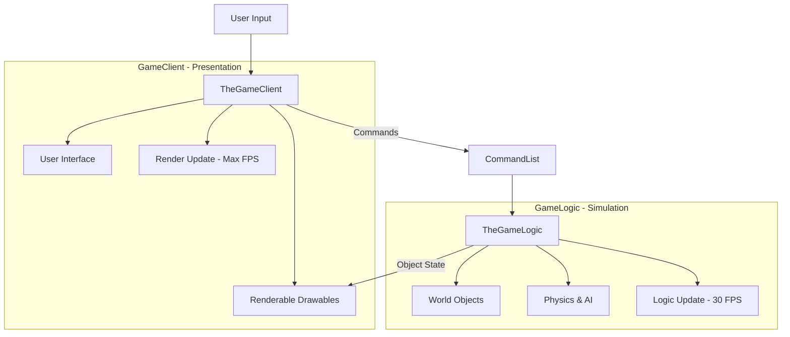

# Core Architecture: Logic/Client Separation

The engine enforces a strict separation between the authoritative simulation (**GameLogic**) and the presentation layer (**GameClient**). This is a fundamental design principle that enables deterministic replays, network synchronization, and headless operation.

## Key Subsystems

### 1. GameLogic (`TheGameLogic`)
- **Responsibility**: Authoritative simulation of the game world.
- **State**: Contains all game objects, physics, AI, pathfinding, and script state.
- **Frequency**: Runs at a fixed **30 FPS** (logic frames).
- **Determinism**: Must be bit-perfect across all clients in a multiplayer match. It should NOT depend on rendering framerate, system time, or UI state.

### 2. GameClient (`TheGameClient`)
- **Responsibility**: Presentation of the game state to the user.
- **State**: Contains renderable objects (Drawables), UI elements, sounds, and input handling.
- **Frequency**: Runs at the highest possible framerate (variable FPS).
- **Interpolation**: Responsible for smooth movement of units between fixed logic frames.

## Interaction Flow

1.  **Input Collection**: `TheGameClient` collects user input (mouse clicks, key presses).
2.  **Command Issuance**: Input is translated into `CommandClass` objects and sent to `TheGameLogic` via the command list.
3.  **Authoritative Update**: `TheGameLogic` processes commands and updates the world state at 30 FPS.
4.  **Visual Update**: `TheGameClient` reads the state of `TheGameLogic` (e.g., unit positions) and updates `Drawables` for rendering.

## Architecture Benefits

- **Deterministic Replay**: By recording only the initial seeds and the command list, the logic can be re-simulated exactly.
- **Headless Operation**: The game can run as a server without any `GameClient` (no rendering/audio).
- **Network Sync**: In multiplayer, only logic commands are exchanged. If logic diverges between players, an "Out of Sync" error occurs.

## Code Entry Points

- **Logic Entry**: `GeneralsMD/Code/GameEngine/Source/GameLogic/System/GameLogic.cpp`
- **Client Entry**: `GeneralsMD/Code/GameEngine/Source/GameClient/GameClient.cpp`
- **Coordination**: `GameEngine::update()` in `GeneralsMD/Code/GameEngine/Source/Common/GameEngine.cpp` orchestrates the loop.
