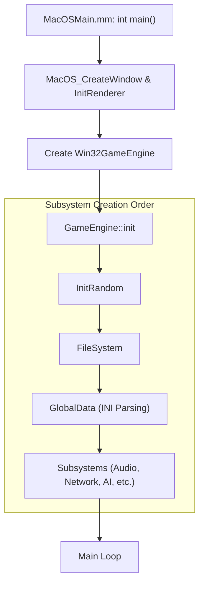

# Engine Initialization and Main Loop (macOS)

The engine's lifecycle is managed by the platform-specific entry point and a unified loop in `GameEngine`. On macOS, the primary entry point is `MacOSMain.mm`.

## Initialization Sequence



1.  **Platform Setup**: Native macOS window is created, and the Metal renderer is initialized (`MacOS_CreateWindow`, `MacOS_InitRenderer`).
2.  **Engine Creation**: The `Win32GameEngine` instance is created (class name kept for compatibility).
3.  **Global Objects**: Critical globals like `TheFramePacer`, `TheFileSystem`, and `TheSubsystemList` are initialized.
4.  **Subsystem Initialization**: `GameEngine::init()` is called, which in turn initializes:
    - Random Number System
    - File Systems (Local, Archive/BIG)
    - Global Data (INI parsing)
    - Engine Subsystems (AI, Physics, Network, etc.)
    - **TheGameClient** (which creates TheTerrainVisual, TheInGameUI, TheShell, etc.)
    - **TheAI**
    - **TheGameLogic**
    - **ThePlayerList**
5.  **TerrainVisual Exception**: `W3DTerrainVisual::init()` throws `ERROR_BUG` due to memory pool issues with `HeightMapRenderObjClass`. This is caught in a try-catch inside `GameClient::init()`. `TheTerrainVisual` is set to `nullptr`. Init continues.
6.  **Reset Phase**: `resetSubsystems()` is called at the end of `GameEngine::init()` to bring all subsystems to a clean state.
7.  **Factory Methods**: The engine uses factory methods to create platform-specific implementations (e.g., `MacOSGameClient`, `MacOSAudioManager`).

## The Main Loop (The Heartbeat)

The main loop is executed within `Win32GameEngine::update()` (orchestrated by the OS app delegate).

### Logic/Render Frame Flow

```cpp
void Win32GameEngine::update() {
  // 1. Begin Rendering Frame
  if (GetRenderDevice()) {
    GetRenderDevice()->BeginScene();
  }

  // 2. Update Global Timer
  TheMessageTime = timeGetTime();

  // 3. Central Engine Update
  GameEngine::update();

  // 4. End Rendering Frame
  if (GetRenderDevice()) {
    GetRenderDevice()->EndScene();
  }

  // 5. System Event Handling
  serviceWindowsOS();
}
```

### Key Loop Components:

- **TheFramePacer**: Regulates the logic update frequency (30 FPS) while allowing the rendering to run as fast as possible.
- **serviceWindowsOS**: Pumps native macOS events (`MacOS_PumpEvents`) and maintains a Windows-compatible message queue for legacy UI logic.
- **TheMessageTime**: A global timestamp used for UI animations, transitions, and timers.

## Shutdown Sequence

1.  **Quitting Bit**: `TheGameEngine->setQuitting(true)` is set when the window is closed.
2.  **Destruction**: Subsystems are shut down in reverse order.
3.  **Platform Cleanup**: Metal resources and window are released.
