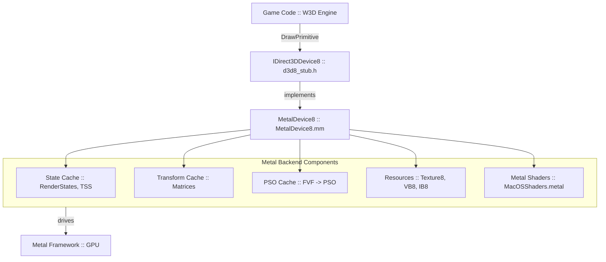
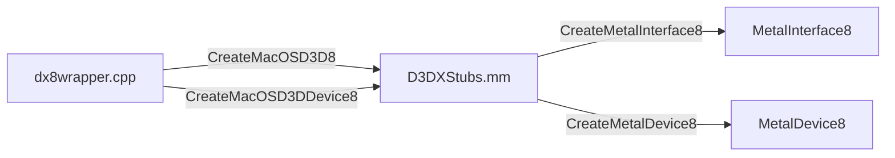

# Graphics Rendering Pipeline (macOS) — Architecture Cheatsheet

The rendering pipeline in the macOS port bridges the original DirectX 8 based W3D engine with Apple **Metal** API.
**Last updated:** 2026-02-18

## High-Level Architecture



## Key Files

| File | Purpose |
|:---|:---|
| `Platform/MacOS/Source/Metal/MetalDevice8.h` | `IDirect3DDevice8` declaration + state members |
| `Platform/MacOS/Source/Metal/MetalDevice8.mm` | Full implementation (~2010 lines) |
| `Platform/MacOS/Source/Metal/MetalInterface8.h/mm` | `IDirect3D8`, factory for `MetalDevice8` |
| `Platform/MacOS/Source/Metal/MetalVertexBuffer8.h/mm` | VB: system memory copy + lazy `MTLBuffer` |
| `Platform/MacOS/Source/Metal/MetalIndexBuffer8.h/mm` | IB: system memory copy + lazy `MTLBuffer` |
| `Platform/MacOS/Source/Metal/MetalTexture8.h/mm` | Texture: `MTLTexture` + `LockRect` staging |
| `Platform/MacOS/Source/Main/D3DXStubs.mm` | D3DX functions + entry points |
| `Platform/MacOS/Source/Main/MacOSShaders.metal` | Metal shaders (`vertex_main`, `fragment_main`) |
| `Core/Libraries/Source/WWVegas/WWLib/d3d8_stub.h` | COM interfaces, enums, types |

## Memory Management (W3DMPO_GLUE)

Resource classes use `W3DMPO_GLUE(ClassName)` from `always.h`:
- **On macOS**: expands to `MEMORY_POOL_GLUE_WITHOUT_GCMP_NO_DTOR` + `GCMP_CREATE`.
- This means pools are auto-created on first use.
- Must use `W3DNEW` (= `new(__FILE__, __LINE__)`) to allocate. Standard `new` will CRASH.
- ⚠️ `Release()` uses `delete this` which triggers `DEBUG_CRASH` in the pool's `operator delete`.
  In release builds: works (`freeBlock` called). In debug: assertion fail. Consider `deleteInstance()` later.

## PSO Cache Details

Key: `uint32_t fvf`.
Current PSO creation: hardcoded Standard Alpha Blend, no depth. 
Future: key should be `hash(fvf, srcBlend, dstBlend, depthEnable, cullMode, ...)`.

## Uniform Buffer Layout (MetalUniforms)

```cpp
struct MetalUniforms {
    simd::float4x4 world;       // m_Transforms[D3DTS_WORLD]   (256)
    simd::float4x4 view;        // m_Transforms[D3DTS_VIEW]    (2)
    simd::float4x4 projection;  // m_Transforms[D3DTS_PROJECTION] (3)
    simd::float2 screenSize;    // (m_ScreenWidth, m_ScreenHeight)
    int useProjection;          // 1=3D, 2=ScreenSpace(XYZRHW)
    uint32_t shaderSettings;    // bit field (texturing, fog, etc.)
};
// Bound at buffer index 1 for both vertex and fragment stages.
```

## Entry Points



## Implementation Stage Status (see DX8_METAL_BACKEND.md)

| Stage | Status |
|:---|:---|
| 0: Skeleton | ✅ |
| 1: Scene+Clear | ✅ |
| 2: VB/IB | ✅ |
| 3: Pipeline+Draw | ✅ |
| 4: Transforms | ✅ |
| 5: Textures | 🟢 Partial (no 16-bit conv, no MetalSurface8) |
| 6: Render States | ✅ Dynamic PSO (blend/cull/depth/colorWriteMask) |
| 7: TSS | ✅ Full DX8 TSS (2 stages, sampler cache, FragmentUniforms, alpha test) |
| 8: Lighting | ✅ Full DX8 per-vertex (4 lights, dir/point/spot, material sources, normals) |
| 9: Fog | ✅ Full DX8 vertex fog (LINEAR/EXP/EXP2, per-vertex factor, proper blending) |
| 10: Depth+RT | ✅ Depth+Stencil (`Depth32Float_Stencil8`), full stencil ops, DSS cache. No MetalSurface8 |
| 11: Resources | ❌ |
