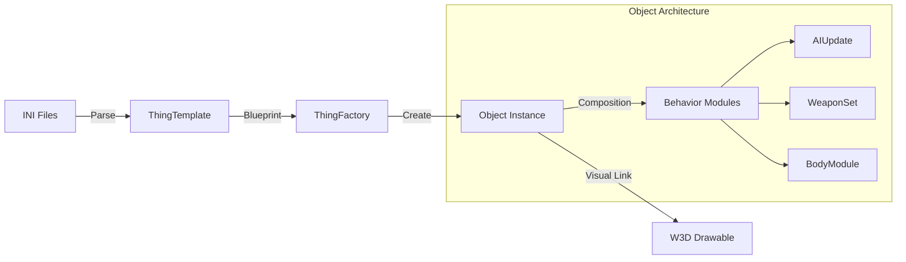

# Object System Architecture

The SAGE engine uses a highly data-driven, composition-based object system. Instead of deep inheritance hierarchies, object behavior is defined by attaching **Modules** to a base **Object** class.

## Core Concepts

### 1. ThingTemplate (`TheThingFactory`)
- Loaded from INI files (e.g., `Data\INI\Object\AmericaVehicle.ini`).
- Defines the "blueprint" for a unit type: cost, health, speed, and what modules it possesses.
- Managed globally by `TheThingFactory`.

### 2. Object (Instance)
- Represents a specific unit, building, or projectile in the game world.
- Holds instance-specific data: position, current health, ownership (Player), and team.
- Updates its state by iterating through its attached modules.

### 3. Module System
Behavior is encapsulated in small, focused modules. A typical unit has:
- **BodyModule**: Manages health and destruction logic.
- **WeaponSetModule**: Manages primary/secondary weapons and reloading.
- **AIUpdate**: Decides what the unit should do (move, attack, idle).
- **Locomotor**: Handles physical movement on the terrain.

### 4. Logic/Visual Separation
An `Object` does not know how to draw itself. Instead, it owns a **DrawableInfo** or **Drawable** pointer:
- `TheGameLogic` updates the `Object` (position, animation state).
- `TheGameClient` reads these properties and commands the `Drawable` (handled by W3D engine) to render the correct frame.

## Object Lifecycle

1.  **Creation**: `TheThingFactory::createThing` allocates an `Object` based on a template name.
2.  **Initialization**: Modules are instantiated and their `init()` methods called.
3.  **World Entry**: The object is added to the spatial partition and visibility lists.
4.  **Update Loop**: 
    - `Object::update()` -> calls `Module::update()` for all behaviors.
    - AI modules issue commands; Locomotor updates position.
5.  **Destruction**: When health reaching zero, the `BodyModule` triggers removal. Visual "death" (debris, explosions) is handled by the `GameClient`.

## Spatial Partitioning

To handle thousands of objects efficiently, the engine uses a grid-based spatial partition. This speeds up:
- **Collision Detection**: Only check nearby objects.
- **AI Scanning**: Finding the closest target.
- **Rendering**: Quickly identifying objects within the camera frustum.
