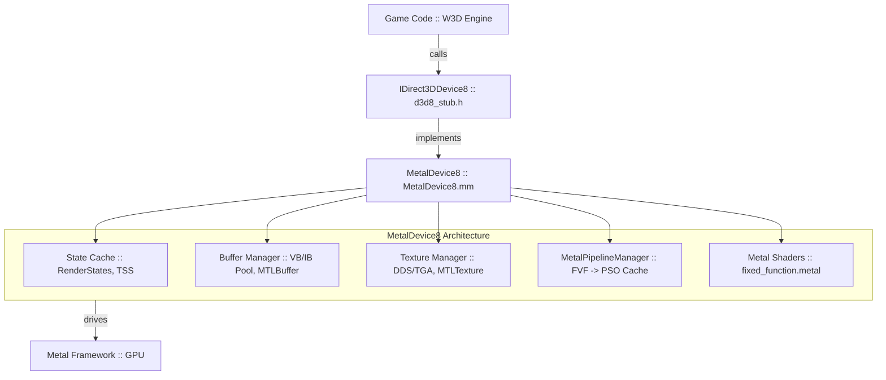
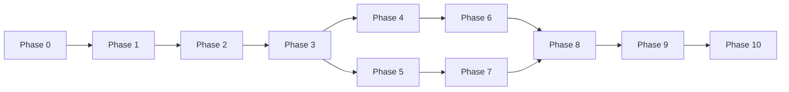

# DX8 → Metal Graphics Backend — Implementation Plan

> **Goal:** A clean, DX8.1-compliant implementation of the graphics backend using Metal.
> Replaces all ad-hoc stubs with a single architecturally-clean adapter.

## Architecture



## What to Remove / Replace

| File | Action |
|:---|:---|
| `MacOSRenderer.mm` (858 lines) | **REMOVE** — replaced by MetalDevice8 |
| `MacOSShaders.metal` (104 lines) | **REMOVE** — replaced by `fixed_function.metal` |
| `Shaders.metal` | **REMOVE** — duplicate |
| `MacOSRenderDevice_Internal.h` | **REMOVE** — replaced by MetalDevice8.h |
| `IRenderDevice.h` | **REMOVE** — not needed, using IDirect3DDevice8 |
| `D3DXStubs.cpp` | **UPDATE** — fill missing functionality |

## What to Keep

- `d3d8_stub.h` — all types, enums, interfaces (already correct)
- `dx8wrapper.h/cpp` — W3D wrapper, calls our MetalDevice8
- `d3dx8math.h`, `d3dx8tex.h` — helper functions
- Rest of the engine — DO NOT TOUCH

---

## Sources of Truth

1. **`documentation.pdf`** (549 pages) — DX8.1 SDK, lighting formulas, TSS, blend states
2. **`d3d8_stub.h`** (1115 lines) — all enums/types/interfaces
3. **`dx8wrapper.h`** (1546 lines) — what methods are actually called
4. **`dx8_spec_extracted.txt`** (497 KB) — extracted specification text

---

## Implementation Phases

### Phase 0: Skeleton (Foundation)
**Goal:** `MetalDevice8` compiles and the engine launches through it.

**Files:**
- `Platform/MacOS/Source/Metal/MetalDevice8.h` — Declarations
- `Platform/MacOS/Source/Metal/MetalDevice8.mm` — Implementation
- `Platform/MacOS/Source/Metal/MetalInterface8.h` — `IDirect3D8`
- `Platform/MacOS/Source/Metal/MetalInterface8.mm` — Implementation

**Tasks:**
1. Create class `MetalDevice8 : IDirect3DDevice8` with ALL methods (stubs, return `D3D_OK`).
2. Create class `MetalInterface8 : IDirect3D8` (`CreateDevice` → creates `MetalDevice8`).
3. In `dx8wrapper.cpp`, functions `CreateMacOSD3D8()` and `CreateMacOSD3DDevice8()` — return our classes.
4. Initialize Metal device, command queue, and `CAMetalLayer` in the constructor.
5. **Verification:** Game launches, logs show calls to all methods.

**Readiness Criteria:** Build passes, game launches, empty screen.

---

### Phase 1: Scene Management + Clear
**Goal:** Black screen with the correct clear color.

**Specification (`documentation.pdf` p.258):**
- `BeginScene` — start of frame rendering
- `EndScene` — end of frame rendering
- `Present` — display backbuffer on screen
- `Clear` — fill render target with color/depth/stencil

**Implementation:**
```
BeginScene   → [m_CommandQueue commandBuffer], nextDrawable, beginEncoder
EndScene     → endEncoder
Present      → presentDrawable, commitCommandBuffer
Clear(flags) → MTLRenderPassDescriptor with clearColor/clearDepth
```

**Tasks:**
1. `BeginScene()` — create `MTLCommandBuffer`, acquire drawable, start render pass.
2. `EndScene()` — end render pass encoder.
3. `Present()` — present drawable, commit command buffer.
4. `Clear(count, rects, flags, color, z, stencil)`:
   - `D3DCLEAR_TARGET` → `loadAction = MTLLoadActionClear`, `clearColor` from `D3DCOLOR`.
   - `D3DCLEAR_ZBUFFER` → `clearDepth`.
   - `D3DCLEAR_STENCIL` → `clearStencil`.
5. `SetViewport(D3DVIEWPORT8)` → `[encoder setViewport:]`.

**Criteria:** Screen is filled with the color specified by the game.

---

### Phase 2: Vertex/Index Buffers
**Goal:** Geometry is created and stored in GPU memory.

**Specification (`d3d8_stub.h`, lines 883-895):**
- `IDirect3DVertexBuffer8` — `Lock`/`Unlock`/`GetDesc`
- `IDirect3DIndexBuffer8` — `Lock`/`Unlock`/`GetDesc`

**Files:**
- `Platform/MacOS/Source/Metal/MetalVertexBuffer8.h/mm`
- `Platform/MacOS/Source/Metal/MetalIndexBuffer8.h/mm`

**Implementation:**
```
CreateVertexBuffer(length, usage, fvf, pool) → MetalVertexBuffer8
  - MTLBuffer with MTLResourceStorageModeShared
  - Stores FVF, size
  
Lock(offset, size, &ptr, flags) → contents() + offset
Unlock() → no-op (shared memory), or didModifyRange
```

**FVF (Flexible Vertex Format) Parser** — a critical component:
```
FVF bits → stride and layout:
  D3DFVF_XYZ      → float3 position (12 bytes)
  D3DFVF_XYZRHW   → float4 position (16 bytes, pre-transformed)
  D3DFVF_NORMAL   → float3 normal (12 bytes)
  D3DFVF_DIFFUSE  → DWORD color (4 bytes)
  D3DFVF_SPECULAR → DWORD color (4 bytes)
  D3DFVF_TEX1     → float2 uv (8 bytes)
  D3DFVF_TEX2     → + float2 uv2 (8 bytes)
  D3DFVF_XYZBn    → bone weights
```

**Tasks:**
1. Implement `MetalVertexBuffer8` with `MTLBuffer` backing.
2. Implement `MetalIndexBuffer8` (16-bit indices).
3. FVF parser: `DWORD fvf` → `{stride, offsets for position, normal, diffuse, specular, texN}`.
4. `CreateVertexBuffer` / `CreateIndexBuffer` in `MetalDevice8`.
5. `SetStreamSource(stream, vb, stride)` — remember current VB.
6. `SetIndices(ib, baseVertex)` — remember current IB.

**Criteria:** Buffers are created without crashes, `Lock`/`Unlock` work.

---

### Phase 3: Pipeline State + Draw Calls
**Goal:** Triangles are drawn on screen (white, no textures).

**Specification:**
- `DrawPrimitive(type, startVertex, primCount)`
- `DrawIndexedPrimitive(type, minIndex, numVertices, startIndex, primCount)`
- Primitive types: `TRIANGLELIST`, `TRIANGLESTRIP`, `TRIANGLEFAN`, `LINELIST`, `LINESTRIP`

**Pipeline State Object (PSO) Cache:**
```
PSO key = hash(FVF, blendEnable, srcBlend, dstBlend, 
               depthEnable, depthWrite, depthFunc,
               cullMode, colorWriteMask)
```

**Files:**
- `Platform/MacOS/Source/Metal/MetalPipelineManager.h/mm`

**Tasks:**
1. FVF → `MTLVertexDescriptor` mapping.
2. PSO cache: `std::unordered_map<uint64_t, id<MTLRenderPipelineState>>`.
3. Depth/Stencil state cache: `std::unordered_map<uint32_t, id<MTLDepthStencilState>>`.
4. `DrawPrimitive` → `[encoder drawPrimitives:vertexStart:vertexCount:]`.
5. `DrawIndexedPrimitive` → `[encoder drawIndexedPrimitives:indexCount:indexType:indexBuffer:indexBufferOffset:]`.
6. Primitive type mapping:
   - `D3DPT_TRIANGLELIST` → `MTLPrimitiveTypeTriangle`
   - `D3DPT_TRIANGLESTRIP` → `MTLPrimitiveTypeTriangleStrip`
   - `D3DPT_LINELIST` → `MTLPrimitiveTypeLine`
   - `D3DPT_LINESTRIP` → `MTLPrimitiveTypeLineStrip`
   - `D3DPT_TRIANGLEFAN` → convert to triangle list (not natively supported by Metal).

**Criteria:** Triangles are visible on screen.

---

### Phase 4: Transforms (Matrices)
**Goal:** 3D transformations work — objects are in correct positions.

**Specification (`d3d8_stub.h` lines 633-645):**
```
D3DTS_WORLD      = 256  → Model matrix
D3DTS_VIEW       = 2    → Camera matrix  
D3DTS_PROJECTION = 3    → Projection matrix
D3DTS_TEXTUREn   = 16+n → Texture coordinate transform
```

**Formula (Standard):**
```
clipPos = Projection × View × World × localPos
```

**For pre-transformed vertices (D3DFVF_XYZRHW):**
```
clipPos.x = (x / screenWidth) * 2 - 1
clipPos.y = 1 - (y / screenHeight) * 2
clipPos.z = z
clipPos.w = 1/rhw
```

**Uniform buffer layout:**
```metal
struct Uniforms {
    float4x4 world;
    float4x4 view;  
    float4x4 projection;
    float4x4 texTransform[2];
    float2 screenSize;
    float2 _padding;
};
```

**Tasks:**
1. `SetTransform(state, matrix)` — save to `m_Transforms[state]` array.
2. `GetTransform(state, matrix)` — return from array.
3. Before draw call: fill uniform buffer and bind to encoder.
4. Vertex shader: multiply position by WVP.
5. Handling of `XYZRHW` (2D mode, UI) — screen space → clip space.

**Criteria:** UI elements in correct positions, 3D objects with perspective.

---

### Phase 5: Textures
**Goal:** Textures are loaded and displayed on geometry.

**Specification (`d3d8_stub.h` lines 917-926):**
```
IDirect3DTexture8 — GetLevelDesc, GetSurfaceLevel, LockRect, UnlockRect
```

**Files:**
- `Platform/MacOS/Source/Metal/MetalTexture8.h/mm`
- `Platform/MacOS/Source/Metal/MetalSurface8.h/mm`

**Texture Formats (DX8 → Metal Mapping):**
| D3DFORMAT | Metal | Bytes/pixel |
|:---|:---|:---|
| `D3DFMT_A8R8G8B8` | `MTLPixelFormatBGRA8Unorm` | 4 |
| `D3DFMT_X8R8G8B8` | `MTLPixelFormatBGRA8Unorm` | 4 |
| `D3DFMT_R5G6B5` | `MTLPixelFormatB5G6R5Unorm`* | 2 |
| `D3DFMT_A1R5G5B5` | `MTLPixelFormatA1BGR5Unorm`* | 2 |
| `D3DFMT_A4R4G4B4` | `MTLPixelFormatABGR4Unorm`* | 2 |
| `D3DFMT_A8` | `MTLPixelFormatA8Unorm` | 1 |
| `D3DFMT_DXT1` | `MTLPixelFormatBC1_RGBA` | 0.5 |
| `D3DFMT_DXT2/3` | `MTLPixelFormatBC2_RGBA` | 1 |
| `D3DFMT_DXT4/5` | `MTLPixelFormatBC3_RGBA` | 1 |
| `D3DFMT_L8` | `MTLPixelFormatR8Unorm` | 1 |
| `D3DFMT_P8` | → convert to `A8R8G8B8` | 4 |

\* Some 16-bit formats are not available on macOS Metal — convert to `BGRA8`.

**Tasks:**
1. `CreateTexture(w, h, levels, usage, format)` → `MetalTexture8`.
2. `LockRect(level, &rect, rect, flags)` → staging buffer.
3. `UnlockRect(level)` → blit staging → `MTLTexture`.
4. `SetTexture(stage, texture)` → `[encoder setFragmentTexture:atIndex:]`.
5. DDS loader integration (already partially exists).
6. Swizzle `ARGB` → `BGRA` if necessary.

**Criteria:** Textures are visible on geometry.

---

### Phase 6: Render States
**Goal:** Transparency, z-buffer, and face culling work correctly.

**Specification (`d3d8_stub.h` lines 404-482):**

**Group 1: Depth/Stencil → `MTLDepthStencilDescriptor`**
| D3DRS | Metal |
|:---|:---|
| `D3DRS_ZENABLE` | `depthCompareFunction != Never` |
| `D3DRS_ZWRITEENABLE` | `isDepthWriteEnabled` |
| `D3DRS_ZFUNC` | `depthCompareFunction` (`D3DCMP` → `MTLCompareFunction`) |
| `D3DRS_STENCILENABLE` | stencil configuration |
| `D3DRS_STENCILFUNC/REF/MASK` | `frontFaceStencil` |

**Mapping D3DCMP → MTLCompareFunction:**
```
D3DCMP_NEVER        → MTLCompareFunctionNever
D3DCMP_LESS         → MTLCompareFunctionLess  
D3DCMP_EQUAL        → MTLCompareFunctionEqual
D3DCMP_LESSEQUAL    → MTLCompareFunctionLessEqual
D3DCMP_GREATER      → MTLCompareFunctionGreater
D3DCMP_NOTEQUAL     → MTLCompareFunctionNotEqual
D3DCMP_GREATEREQUAL → MTLCompareFunctionGreaterEqual
D3DCMP_ALWAYS       → MTLCompareFunctionAlways
```

**Group 2: Alpha Blending → `MTLRenderPipelineColorAttachmentDescriptor`**
| D3DRS | Metal |
|:---|:---|
| `D3DRS_ALPHABLENDENABLE` | `blendingEnabled` |
| `D3DRS_SRCBLEND` | `sourceRGBBlendFactor` |
| `D3DRS_DESTBLEND` | `destinationRGBBlendFactor` |
| `D3DRS_BLENDOP` | `rgbBlendOperation` |

**Mapping D3DBLEND → MTLBlendFactor:**
```
D3DBLEND_ZERO         → MTLBlendFactorZero
D3DBLEND_ONE          → MTLBlendFactorOne
D3DBLEND_SRCCOLOR     → MTLBlendFactorSourceColor
D3DBLEND_INVSRCCOLOR  → MTLBlendFactorOneMinusSourceColor
D3DBLEND_SRCALPHA     → MTLBlendFactorSourceAlpha
D3DBLEND_INVSRCALPHA  → MTLBlendFactorOneMinusSourceAlpha
D3DBLEND_DESTALPHA    → MTLBlendFactorDestinationAlpha
D3DBLEND_INVDESTALPHA → MTLBlendFactorOneMinusDestinationAlpha
D3DBLEND_DESTCOLOR    → MTLBlendFactorDestinationColor
D3DBLEND_INVDESTCOLOR → MTLBlendFactorOneMinusDestinationColor
D3DBLEND_SRCALPHASAT  → MTLBlendFactorSourceAlphaSaturated
```

**Group 3: Miscellaneous → encoder calls**
| D3DRS | Metal |
|:---|:---|
| `D3DRS_CULLMODE` | `[encoder setCullMode:]` |
| `D3DRS_FILLMODE` | `[encoder setTriangleFillMode:]` |
| `D3DRS_ALPHATESTENABLE + D3DRS_ALPHAREF` | fragment shader discard |
| `D3DRS_COLORWRITEENABLE` | `colorWriteMask` on PSO |

**Mapping D3DCULL → MTLCullMode:**
```
D3DCULL_NONE → MTLCullModeNone
D3DCULL_CW   → MTLCullModeFront (DX8 CW = Metal Front)
D3DCULL_CCW  → MTLCullModeBack
```
*Note: DX8 and Metal use different default winding orders!*

**Tasks:**
1. `SetRenderState(state, value)` — cache in `m_RenderStates[256]` array.
2. Dirty tracking: when RS changes, mark corresponding Metal state as dirty.
3. Before draw: re-create necessary Metal state objects.
4. PSO cache including blend state in the key.
5. Depth/Stencil state cache.

**Criteria:** Transparent objects are drawn correctly, no z-fighting.

---

### Phase 7: Texture Stage States (The Hard Part!)
**Goal:** Multi-texturing and texture blending work just like in DX8.

**Specification (`d3d8_stub.h` lines 681-709, 768-796, 815-823):**

DX8 has up to 8 texture stages. Each stage:
- Inputs: `D3DTA_TEXTURE`, `D3DTA_CURRENT`, `D3DTA_DIFFUSE`, `D3DTA_TFACTOR`, `D3DTA_SPECULAR`
- Operation: `D3DTOP_*` (color and alpha separately)
- Modifiers: `D3DTA_COMPLEMENT` (1-x), `D3DTA_ALPHAREPLICATE` (a,a,a,a)

**D3DTOP Formulas (from spec):**
```
D3DTOP_DISABLE            = this and subsequent stages are disabled
D3DTOP_SELECTARG1         = Arg1
D3DTOP_SELECTARG2         = Arg2
D3DTOP_MODULATE           = Arg1 × Arg2
D3DTOP_MODULATE2X         = Arg1 × Arg2 × 2
D3DTOP_MODULATE4X         = Arg1 × Arg2 × 4
D3DTOP_ADD                = Arg1 + Arg2
D3DTOP_ADDSIGNED          = Arg1 + Arg2 - 0.5
D3DTOP_ADDSIGNED2X        = (Arg1 + Arg2 - 0.5) × 2
D3DTOP_SUBTRACT           = Arg1 - Arg2
D3DTOP_ADDSMOOTH          = Arg1 + Arg2 - Arg1 × Arg2
D3DTOP_BLENDDIFFUSEALPHA  = Arg1 × Alpha(Diffuse) + Arg2 × (1 - Alpha(Diffuse))
D3DTOP_BLENDTEXTUREALPHA  = Arg1 × Alpha(Texture) + Arg2 × (1 - Alpha(Texture))
D3DTOP_BLENDFACTORALPHA   = Arg1 × Alpha(Factor) + Arg2 × (1 - Alpha(Factor))
D3DTOP_BLENDCURRENTALPHA  = Arg1 × Alpha(Current) + Arg2 × (1 - Alpha(Current))
D3DTOP_MODULATEALPHA_ADDCOLOR   = Arg1.RGB + Arg1.A × Arg2.RGB
D3DTOP_MODULATECOLOR_ADDALPHA   = Arg1.RGB × Arg2.RGB + Arg1.A
D3DTOP_MODULATEINVALPHA_ADDCOLOR = (1-Arg1.A) × Arg2.RGB + Arg1.RGB
D3DTOP_MODULATEINVCOLOR_ADDALPHA = (1-Arg1.RGB) × Arg2.RGB + Arg1.A
D3DTOP_DOTPRODUCT3        = dot(Arg1, Arg2) × 4 (in range [-1,1])
D3DTOP_MULTIPLYADD        = Arg0 + Arg1 × Arg2
D3DTOP_LERP               = Arg0 × Arg1 + (1-Arg0) × Arg2
```

**Sampler States from TSS:**
| D3DTSS | Metal |
|:---|:---|
| `D3DTSS_ADDRESSU` | `MTLSamplerAddressMode` |
| `D3DTSS_ADDRESSV` | `MTLSamplerAddressMode` |
| `D3DTSS_MINFILTER` | `MTLSamplerMinMagFilter` |
| `D3DTSS_MAGFILTER` | `MTLSamplerMinMagFilter` |
| `D3DTSS_MIPFILTER` | `MTLSamplerMipFilter` |

**Implementation Approach:**

Generals mainly uses 2 texture stages. Instead of fully emulating 8 stages, we'll use a uniform buffer to pass operations and arguments to the fragment shader:

```metal
struct TextureStageConfig {
    uint colorOp;     // D3DTOP enum
    uint colorArg1;   // D3DTA enum
    uint colorArg2;   // D3DTA enum
    uint alphaOp;     // D3DTOP enum
    uint alphaArg1;   // D3DTA enum
    uint alphaArg2;   // D3DTA enum
};

struct FragmentUniforms {
    TextureStageConfig stages[2];
    float4 textureFactor;  // D3DRS_TEXTUREFACTOR
    float4 fogColor;
    float fogStart;
    float fogEnd;
    float fogDensity;
    uint fogMode;
    uint alphaTestEnable;
    uint alphaFunc;
    float alphaRef;
};
```

**Tasks:**
1. `SetTextureStageState(stage, type, value)` — cache in `m_TSS[stage][type]`.
2. Fragment uniform buffer with `TextureStageConfig`.
3. Fragment shader: calculation based on `D3DTOP` formulas.
4. Sampler state cache: `std::map<uint32_t, id<MTLSamplerState>>`.
5. Texture coordinate generation (`D3DTSS_TEXCOORDINDEX` flags).

**Criteria:** Multi-texturing works, terrain with two textures is visible.

---

### Phase 8: Lighting (per-vertex)
**Goal:** Per-vertex lighting using DX8 formulas.

**Specification (`documentation.pdf` p.118-119):**

**Global Illumination Formula:**
```
VertexColor = Emissive + Ambient_global + Σ(Ambient_i + Diffuse_i + Specular_i)
```

**Diffuse Formula:**
```
Diffuse_i = Cd × Ld × max(0, N · Ldir) × Atten × Spot
```
- `Cd` = vertex diffuse color or material diffuse (via `D3DRS_DIFFUSEMATERIALSOURCE`)
- `Ld` = light diffuse color
- `N` = normalized vertex normal
- `Ldir` = normalized direction to light
- `Atten` = 1/(att0 + att1×d + att2×d²) for point/spot, 1.0 for directional

**Specular Formula:**
```
Specular_i = Cs × Ls × max(0, N · H)^P × Atten × Spot
```
- `H` = normalize(Ldir + Vdir) — halfway vector
- `P` = material power (glossiness)

**Spotlight Formula:**
```
Spot = (cos(angle) - cos(Phi/2))^Falloff / (cos(Theta/2) - cos(Phi/2))
```

**Ambient per-light Formula:**
```
Ambient_i = Ca × La × Atten × Spot
```
- `Ca` = vertex ambient color or material ambient
- `La` = light ambient color

**Lighting Uniform Buffer:**
```metal
struct LightData {
    float4 diffuse;
    float4 ambient;
    float4 specular;
    float3 position;
    float range;
    float3 direction;
    float falloff;
    float attenuation0;
    float attenuation1;
    float attenuation2;
    float theta;       // inner cone
    float phi;         // outer cone
    uint type;         // 1=point, 2=spot, 3=directional
    uint enabled;
    float2 _padding;
};

struct LightingUniforms {
    LightData lights[4];
    float4 materialDiffuse;
    float4 materialAmbient;
    float4 materialSpecular;
    float4 materialEmissive;
    float materialPower;
    float4 globalAmbient;
    uint lightingEnabled;
    uint diffuseSource;   // 0=material, 1=color1, 2=color2
    uint ambientSource;
    uint specularSource;
    uint emissiveSource;
};
```

**IMPORTANT:** Generals primarily uses:
- 4 directional lights (sun + 3 fill)
- Vertex colors for terrain highlights
- `D3DRS_LIGHTING = FALSE` for UI and certain effects

**Tasks:**
1. `SetLight(index, D3DLIGHT8)` — save to uniform.
2. `LightEnable(index, bool)` — on/off.
3. `SetMaterial(D3DMATERIAL8)` — save to uniform.
4. `SetRenderState(D3DRS_LIGHTING, v)` — switch.
5. `SetRenderState(D3DRS_AMBIENT, color)` — global ambient.
6. `SetRenderState(D3DRS_DIFFUSEMATERIALSOURCE, v)` — color source.
7. Vertex shader: full calculation of per-vertex lighting using formulas.

**Criteria:** Lit objects, shadows from directional lights.

---

### Phase 9: Fog
**Goal:** Fog works (for distant objects and atmosphere).

**Specification (`documentation.pdf` p.262, `d3d8_stub.h` lines 257-260):**

**Fog Factor Formulas (0 = full fog, 1 = no fog):**
```
Linear: f = (end - d) / (end - start)
Exp:    f = 1 / e^(density × d)
Exp2:   f = 1 / e^(density × d)²
```

**Application:**
```
finalColor = f × objectColor + (1-f) × fogColor
```

**Render States:**
```
D3DRS_FOGENABLE       → on/off
D3DRS_FOGCOLOR        → D3DCOLOR (ARGB)
D3DRS_FOGTABLEMODE    → 0=none, 1=exp, 2=exp2, 3=linear (pixel fog)
D3DRS_FOGVERTEXMODE   → same for vertex fog
D3DRS_FOGSTART        → float (for linear)
D3DRS_FOGEND          → float (for linear)
D3DRS_FOGDENSITY      → float (for exp/exp2)
```

**Tasks:**
1. Pass fog parameters in `FragmentUniforms`.
2. In vertex shader: calculate distance for vertex fog.
3. In fragment shader: apply formula and blend with `fogColor`.

**Criteria:** Fog is visible, distant objects smoothly fade into fog.

---

### Phase 10: Depth Buffer + Render Targets
**Goal:** Z-buffer works, rendering to textures for shadows.

**Tasks:**
1. Create depth texture: `MTLPixelFormatDepth32Float_Stencil8`.
2. Bind to render pass descriptor.
3. `CreateDepthStencilSurface` → `MetalSurface8` with depth `MTLTexture`.
4. `SetRenderTarget(colorSurface, depthSurface)` — change render target.
5. `CreateRenderTarget` → for shadow maps and post-processing.
6. `GetBackBuffer` → return primary render target.

**Criteria:** No z-fighting, correct object occlusion.

---

### Phase 11: Additional Resources
**Goal:** Cube textures, volume textures, surface copy.

**Tasks:**
1. `CreateCubeTexture` → `MetalCubeTexture8` (for environment maps).
2. `CopyRects` → blit encoder copy.
3. `GetFrontBuffer` → screenshots.

---

## Testing Order

| Phase | Visual Result |
|:---|:---|
| 0 | Compilation, empty screen |
| 1 | Black/colored screen (Clear) |
| 2 | Nothing (buffers without drawing) |
| 3 | White triangles |
| 4 | Triangles in correct positions (3D + 2D UI) |
| 5 | Textured objects |
| 6 | Correct transparency, z-buffer |
| 7 | Multi-texturing, terrain |
| 8 | Lit scene |
| 9 | Atmospheric fog |
| 10 | Shadows |

## Code Volume (Estimate)

| Component | Lines |
|:---|:---|
| `MetalDevice8` (all methods) | ~2000 |
| `MetalInterface8` | ~200 |
| `MetalVertexBuffer8` / `IndexBuffer8` | ~300 |
| `MetalTexture8` / `Surface8` | ~500 |
| `MetalPipelineManager` | ~600 |
| `fixed_function.metal` (vertex + fragment) | ~400 |
| FVF parser | ~150 |
| State mapping utilities | ~200 |
| **TOTAL** | **~4350** |

## Interdependencies



Phases 0-6 are must-haves for operational 3D.
Phases 7-10 are for high-quality rendering.
Phase 11 — as needed.
