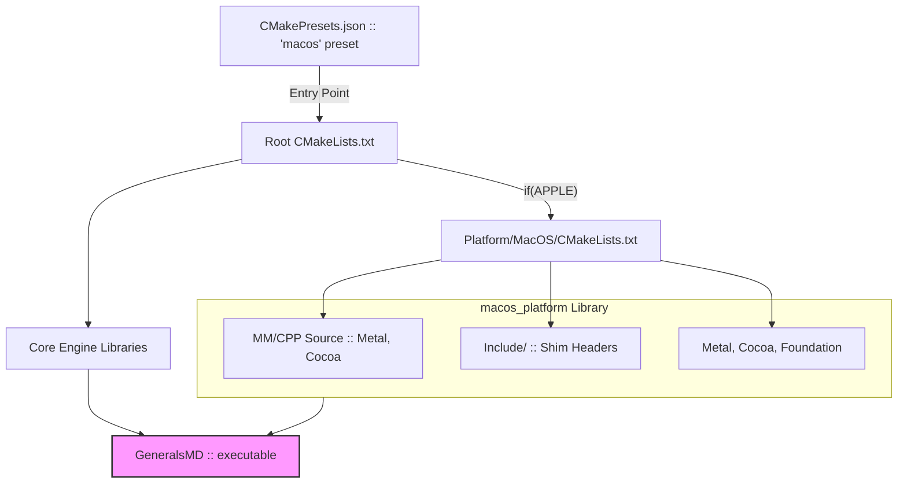

# macOS CMake Integration Plan

## Goal
A unified build system via CMake. A single command: `cmake --preset macos && cmake --build build/macos`.

## Architecture (3 Layers)



## What NOT to Touch
- Files in `GeneralsMD/Code/`, `Core/`, `Generals/` — DO NOT MODIFY.
  All compatibility issues are resolved via include-path and shim headers in `Platform/MacOS/Include/`.

## Step 1: Stub Headers in Platform/MacOS/Include/

`PreRTS.h` includes Windows headers. We DO NOT modify `PreRTS.h`.
Instead, our `-IPlatform/MacOS/Include` is placed BEFORE `-IDependencies/dx8`, and the compiler finds our shim files first.

Need to create stubs for:
- [x] `windows.h`        (exists)
- [x] `malloc.h`         (exists)
- [x] `d3d8.h` and `d3d8*.h` (exist, point to `d3d8_stub`)
- [ ] `atlbase.h`        → empty or minimal stub (ATL not needed on macOS)
- [ ] `direct.h`         → stub
- [ ] `excpt.h`          → stub  
- [ ] `imagehlp.h`       → stub
- [ ] `io.h`             → stub
- [ ] `lmcons.h`         → stub
- [ ] `mmsystem.h`       → stub (`timeGetTime` etc.)
- [ ] `objbase.h`        → stub (COM)
- [ ] `ocidl.h`          → stub
- [ ] `process.h`        → stub (`_beginthread` etc.)
- [ ] `shellapi.h`       → stub
- [ ] `shlobj.h`         → stub
- [ ] `shlguid.h`        → stub
- [ ] `snmp.h`           → stub
- [ ] `dinput.h`         → stub (keyboard/mouse via Cocoa)
- [ ] `tchar.h`          → forward to `Utility/tchar_compat.h`

## Step 2: Platform/MacOS/CMakeLists.txt

```cmake
add_library(macos_platform STATIC
    Source/Main/MacOSMain.mm
    Source/Main/MacOSRenderer.mm
    Source/Main/MacOSWindowManager.mm
    Source/Main/MacOSGameClient.mm
    Source/Main/MacOSGameWindowManager.mm
    Source/Main/MacOSGadgetDraw.mm
    Source/Main/StdKeyboard.mm
    Source/Main/StdMouse.mm
    Source/Main/D3DXStubs.mm
    Source/Metal/MetalDevice8.mm
    Source/Metal/MetalInterface8.mm
    Source/Metal/MetalTexture8.mm
    Source/Metal/MetalSurface8.mm
    Source/Metal/MetalVertexBuffer8.mm
    Source/Metal/MetalIndexBuffer8.mm
    Source/Audio/MacOSAudioManager.mm
    Source/Client/MacOSDisplay.mm
    Source/Client/MacOSDisplayString.mm
    Source/Renderer/MacOSTexture.mm
    Source/Debug/MacOSScreenshot.mm
    Source/Common/StdBIGFile.cpp
    Source/Common/StdBIGFileSystem.cpp
    Source/Common/StdLocalFile.cpp
    Source/Common/StdLocalFileSystem.cpp
    Source/MacOSGameEngineHooks.cpp
    Source/Stubs/GameSpyStubs.cpp
    Source/Stubs/GitInfoStubs.cpp
    Source/Stubs/LZHLStubs.cpp
    Source/Stubs/MacOSW3DShaderManager.mm
    Source/Stubs/WWDownloadStubs.cpp
    Source/Main/MacOSShaders.metal
)

target_include_directories(macos_platform PUBLIC
    ${CMAKE_CURRENT_SOURCE_DIR}/Include    # shim headers FIRST
)

target_compile_definitions(macos_platform PUBLIC
    RA_MACOS=1
)

target_link_libraries(macos_platform PUBLIC
    "-framework Metal"
    "-framework Cocoa"
    "-framework Foundation"
    "-framework QuartzCore"
)
```

## Step 3: Root CMakeLists.txt Changes

```cmake
# After existing FetchContent block:
if(APPLE)
    add_subdirectory(Platform/MacOS)
endif()

# Modify the dx8/miles/bink condition:
if((WIN32 OR "${CMAKE_SYSTEM}" MATCHES "Windows") AND ${CMAKE_SIZEOF_VOID_P} EQUAL 4)
    include(cmake/miles.cmake)
    include(cmake/bink.cmake)
    include(cmake/dx8.cmake)
endif()
# ↑ Already correct — these are Windows-only
```

## Step 4: GeneralsMD/Code/Main/CMakeLists.txt Changes

```cmake
if(APPLE)
    # macOS build
    target_sources(z_generals PRIVATE MacOSMain.mm)  # If needed, or use from macos_platform
    target_link_libraries(z_generals PRIVATE
        macos_platform
        z_gameengine
        z_gameenginedevice
        zi_always
        "-lz"
    )
else()
    # Windows build (existing)
    target_link_libraries(z_generals PRIVATE
        binkstub comctl32 d3d8 d3dx8 dinput8 dxguid
        imm32 milesstub vfw32 winmm
        z_gameengine z_gameenginedevice zi_always
    )
endif()
```

## Step 5: CMakePresets.json

```json
{
    "name": "macos",
    "displayName": "macOS ARM64 Release",
    "generator": "Ninja",
    "binaryDir": "${sourceDir}/build/${presetName}",
    "cacheVariables": {
        "CMAKE_EXPORT_COMPILE_COMMANDS": "ON",
        "CMAKE_BUILD_TYPE": "Debug",
        "RTS_BUILD_ZEROHOUR": "ON"
    }
}
```

## Step 6: Cleanup
- `build_macos.sh` — Remove
- `setup_dependencies.sh` — Remove
- `Platform/MacOS/Scripts/files.sh` — Remove (file list is now in `CMakeLists.txt`)

## Execution Order
1. Create all stub headers (Step 1)
2. Create `Platform/MacOS/CMakeLists.txt` (Step 2)
3. Modify root `CMakeLists.txt` (Step 3)
4. Modify `GeneralsMD/Code/Main/CMakeLists.txt` (Step 4)
5. Add `macos` preset (Step 5)
6. Run `cmake --preset macos`
7. Iteratively fix compilation errors
