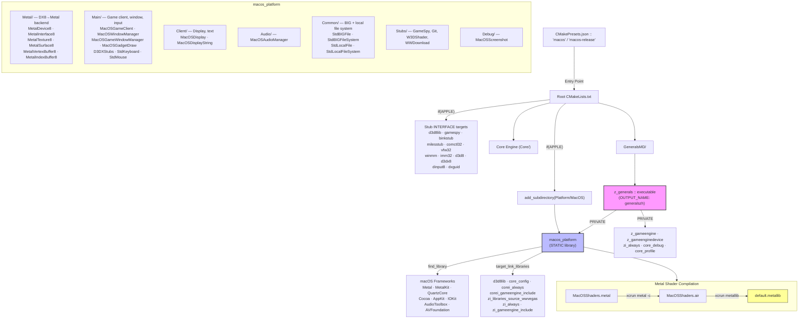

# macOS CMake Integration — Reference

> **Last updated:** 2026-02-21
> **Status:** ✅ Fully implemented & building

## Quick Start

```bash
cmake --preset macos && cmake --build build/macos
# — or Release variant —
cmake --preset macos-release && cmake --build build/macos-release
```

## Architecture (3 Layers)



## What NOT to Touch

Files in `GeneralsMD/Code/`, `Core/`, `Generals/` — **DO NOT MODIFY**.
All compatibility issues are resolved via include-path ordering and shim headers in `Platform/MacOS/Include/`.

---

## Layer 1 — Shim Headers (`Platform/MacOS/Include/`)

`PreRTS.h` includes Windows headers. We **DO NOT** modify `PreRTS.h`.
Instead, `-IPlatform/MacOS/Include` is placed **BEFORE** `-IDependencies/dx8` via the `d3d8lib` INTERFACE target, so the compiler finds our shim files first.

### Implemented shim headers

| Header | Notes |
|---|---|
| `windows.h` | Full Win32 type/API shim (~51 KB) |
| `windowsx.h` | Minimal stub |
| `winerror.h` | HRESULT error codes |
| `winreg.h` | Registry API stubs |
| `wininet.h` | WinInet stubs |
| `winsock.h` | Winsock type stubs |
| `malloc.h` | Forwards to `<stdlib.h>` |
| `d3d8.h` | Redirects to `d3d8_stub.h` |
| `d3d8_stub.h` | Clean C++ interfaces for DX8 (no COM) — Metal implements these |
| `d3d8types.h` | Redirects to `d3d8_stub.h` |
| `d3d8caps.h` | Redirects to `d3d8_stub.h` |
| `d3dx8.h` | D3DX8 core redirect |
| `d3dx8core.h` | ID3DXFont, ID3DXBuffer, ID3DXSprite stubs |
| `d3dx8math.h` | D3DXVECTOR / D3DXMATRIX math stubs |
| `d3dx8effect.h` | Empty stub |
| `d3dx8mesh.h` | Empty stub |
| `d3dx8shape.h` | Empty stub |
| `d3dx8tex.h` | Texture function declarations |
| `ddraw.h` | DirectDraw type stubs |
| `dinput.h` | DirectInput interfaces & key codes |
| `dsound.h` | DirectSound interface stubs |
| `direct.h` | `_mkdir` / `_getcwd` mapping |
| `excpt.h` | Empty stub |
| `imagehlp.h` | Empty stub |
| `io.h` | `_access`, `_finddata_t` etc. |
| `lmcons.h` | `UNLEN` definition |
| `malloc.h` | Forwards to `<stdlib.h>` |
| `mmsystem.h` | `timeGetTime` stub |
| `mbstring.h` | Multi-byte string stubs |
| `mapicode.h` | MAPI error codes |
| `new.h` | Forwards to `<new>` |
| `objbase.h` | COM fundamentals (`CoCreateInstance`, GUID, etc.) |
| `ocidl.h` | Empty stub |
| `oleauto.h` | `SysAllocString` etc. |
| `atlbase.h` | Minimal ATL (`CComPtr`) |
| `atlcom.h` | Empty stub |
| `comip.h` | Empty stub |
| `comutil.h` | Empty stub |
| `process.h` | `_beginthread` mapping |
| `shellapi.h` | `ShellExecute` / `NOTIFYICONDATA` stubs |
| `shlobj.h` | `SHGetFolderPath` etc. |
| `shlguid.h` | Empty stub |
| `snmp.h` | Empty stub |
| `tchar.h` | TCHAR compat macros |
| `vfw.h` | Video for Windows stubs |
| `macos_carbon_compat.h` | Force-included; blocks Carbon sub-headers that conflict with game types |

### Special directories

| Path | Purpose |
|---|---|
| `Include/Common/` | Common header stubs |
| `Include/CompLibHeader/` | Compression library header |
| `Include/EABrowserDispatch/` | EA Browser stubs |
| `Include/EABrowserEngine/` | EA Browser stubs |
| `Include/GameClient/` | GameClient header overrides |
| `Include/Utility/` | `tchar_compat.h` and similar |
| `Include/osdep/` | OS-dependent abstractions |

---

## Layer 2 — `Platform/MacOS/CMakeLists.txt`

The actual file (200 lines). Key sections:

### Source groups

```cmake
# ── Metal rendering backend (DX8 → Metal) ──
set(METAL_SRC
    Source/Metal/MetalDevice8.mm
    Source/Metal/MetalInterface8.mm
    Source/Metal/MetalSurface8.mm
    Source/Metal/MetalTexture8.mm
    Source/Metal/MetalVertexBuffer8.mm
    Source/Metal/MetalIndexBuffer8.mm
)

# ── Main application (game client, window, input, shaders) ──
set(MAIN_SRC
    Source/Main/MacOSGameClient.mm
    Source/Main/MacOSWindowManager.mm
    Source/Main/MacOSGameWindowManager.mm
    Source/Main/MacOSGadgetDraw.mm
    Source/Main/D3DXStubs.mm
    Source/Main/StdKeyboard.mm
    Source/Main/StdMouse.mm
)

# ── Client (display, text rendering) ──
set(CLIENT_SRC
    Source/Client/MacOSDisplay.mm
    Source/Client/MacOSDisplayString.mm
)

# ── Audio ──
set(AUDIO_SRC
    Source/Audio/MacOSAudioManager.mm
)

# ── File system (cross-platform .big + local) ──
set(COMMON_SRC
    Source/Common/StdBIGFile.cpp
    Source/Common/StdBIGFileSystem.cpp
    Source/Common/StdLocalFile.cpp
    Source/Common/StdLocalFileSystem.cpp
)

# ── Stubs (GameSpy, WWDownload — Windows-only libs) ──
# NOTE: LZHLStubs.cpp was REMOVED — real liblzhl is linked via core_compression.
set(STUBS_SRC
    Source/Stubs/GameSpyStubs.cpp
    Source/Stubs/GitInfoStubs.cpp
    Source/Stubs/MacOSW3DShaderManager.mm
    Source/Stubs/WWDownloadStubs.cpp
)

# ── Debug ──
set(DEBUG_SRC
    Source/Debug/MacOSScreenshot.mm
)

add_library(macos_platform STATIC
    ${METAL_SRC} ${MAIN_SRC} ${CLIENT_SRC}
    ${AUDIO_SRC} ${COMMON_SRC} ${STUBS_SRC} ${DEBUG_SRC}
)
```

### Include directories

```cmake
# PUBLIC: shim headers available to dependents
target_include_directories(macos_platform PUBLIC
    ${CMAKE_CURRENT_SOURCE_DIR}/Include
)

# PRIVATE: engine headers needed by .mm implementation files
target_include_directories(macos_platform PRIVATE
    ${CMAKE_CURRENT_SOURCE_DIR}/Source/Metal
    ${CMAKE_SOURCE_DIR}/Core/Libraries/Source/WWVegas/WWLib
    ${CMAKE_SOURCE_DIR}/Core/Libraries/Source/WWVegas
    ${CMAKE_SOURCE_DIR}/Generals/Code/Libraries/Source/WWVegas/WW3D2
    ${CMAKE_SOURCE_DIR}/GeneralsMD/Code/GameEngine/Include/Precompiled
    ${CMAKE_SOURCE_DIR}/GeneralsMD/Code/GameEngine/Include
    ${CMAKE_SOURCE_DIR}/GeneralsMD/Code/GameEngineDevice/Include
    ${CMAKE_SOURCE_DIR}/Generals/Code/Libraries/Source/WWVegas
    ${CMAKE_SOURCE_DIR}/Core/Libraries/Source/WWVegas/WWDebug
    ${CMAKE_SOURCE_DIR}/Core/Libraries/Source/WWVegas/WWMath
    ${CMAKE_SOURCE_DIR}/Core/Libraries/Source/WWVegas/WWSaveLoad
    ${CMAKE_SOURCE_DIR}/Core/Libraries/Source/WWVegas/WW3D2
    ${CMAKE_SOURCE_DIR}/Core/Libraries/Source/WWVegas/WWAudio
    ${CMAKE_SOURCE_DIR}/Core/GameEngineDevice/Include
    ${CMAKE_SOURCE_DIR}/Core/GameEngine/Include
)
```

### Carbon compatibility (force-include)

```cmake
target_compile_options(macos_platform PRIVATE
    -include ${CMAKE_CURRENT_SOURCE_DIR}/Include/macos_carbon_compat.h
)
```

Blocks conflicting Carbon sub-headers (`AIFF`, `Files`, `IntlResources`, `ToolUtils`) and pre-imports Apple frameworks before any game headers. Resolves all Carbon↔Game type conflicts (`WideChar`, `ChunkHeader`, `FileInfo`, `RGBColor`).

### macOS Frameworks

```cmake
find_library(METAL_FRAMEWORK        Metal        REQUIRED)
find_library(METALKIT_FRAMEWORK     MetalKit     REQUIRED)
find_library(QUARTZCORE_FRAMEWORK   QuartzCore   REQUIRED)
find_library(COCOA_FRAMEWORK        Cocoa        REQUIRED)
find_library(APPKIT_FRAMEWORK       AppKit       REQUIRED)
find_library(IOKIT_FRAMEWORK        IOKit        REQUIRED)
find_library(AUDIOTOOLBOX_FRAMEWORK AudioToolbox REQUIRED)
find_library(AVFOUNDATION_FRAMEWORK AVFoundation REQUIRED)

target_link_libraries(macos_platform PUBLIC
    ${METAL_FRAMEWORK}    ${METALKIT_FRAMEWORK}
    ${QUARTZCORE_FRAMEWORK} ${COCOA_FRAMEWORK}
    ${APPKIT_FRAMEWORK}   ${IOKIT_FRAMEWORK}
    ${AUDIOTOOLBOX_FRAMEWORK} ${AVFOUNDATION_FRAMEWORK}
)
```

### Project dependencies

```cmake
# PUBLIC — propagated to z_generals
target_link_libraries(macos_platform PUBLIC
    d3d8lib  core_config  corei_always
    corei_gameengine_include  zi_libraries_source_wwvegas
)

# PRIVATE — ZH-specific, avoid leaking RTS_ZEROHOUR to Generals target
target_link_libraries(macos_platform PRIVATE
    zi_always  zi_gameengine_include
)
```

### Metal Shader Compilation Pipeline

```cmake
# Auto-download Metal Toolchain if missing
execute_process(
    COMMAND xcrun -sdk macosx metal --version
    RESULT_VARIABLE METAL_CHECK_RESULT
    OUTPUT_QUIET ERROR_QUIET
)
if(NOT METAL_CHECK_RESULT EQUAL 0)
    execute_process(COMMAND xcodebuild -downloadComponent MetalToolchain ...)
endif()

set(METAL_SHADER_SOURCE ${CMAKE_CURRENT_SOURCE_DIR}/Source/Main/MacOSShaders.metal)
set(METAL_AIR_OUTPUT    ${CMAKE_CURRENT_BINARY_DIR}/MacOSShaders.air)
set(METAL_LIB_OUTPUT    ${CMAKE_CURRENT_BINARY_DIR}/default.metallib)

# Step 1: .metal → .air
add_custom_command(
    OUTPUT  ${METAL_AIR_OUTPUT}
    COMMAND xcrun -sdk macosx metal -c ${METAL_SHADER_SOURCE} -o ${METAL_AIR_OUTPUT}
    DEPENDS ${METAL_SHADER_SOURCE}
)

# Step 2: .air → .metallib
add_custom_command(
    OUTPUT  ${METAL_LIB_OUTPUT}
    COMMAND xcrun -sdk macosx metallib ${METAL_AIR_OUTPUT} -o ${METAL_LIB_OUTPUT}
    DEPENDS ${METAL_AIR_OUTPUT}
)

add_custom_target(metal_shaders ALL DEPENDS ${METAL_LIB_OUTPUT})
add_dependencies(macos_platform metal_shaders)
```

### ObjC++ / ARC / PCH

```cmake
# ARC enabled for all OBJCXX files
target_compile_options(macos_platform PRIVATE
    $<$<COMPILE_LANGUAGE:OBJCXX>:-fobjc-arc>
)

# Dedicated PCH to avoid mismatch with inherited non-ARC PCH
target_precompile_headers(macos_platform PRIVATE
    [["Utility/CppMacros.h"]]
)
```

---

## Layer 3 — Root `CMakeLists.txt` (macOS-specific sections)

### Project languages

```cmake
if(APPLE)
    project(genzh LANGUAGES C CXX OBJC OBJCXX)
else()
    project(genzh LANGUAGES C CXX)
endif()
```

### Stub INTERFACE targets (replaces Win32 DX8/Miles/Bink)

```cmake
if(APPLE)
    # ── GameSpy SDK ──
    # Doesn't compile on macOS — stubs are in Platform/MacOS/Source/Stubs/
    FetchContent_Declare(gamespy
        GIT_REPOSITORY https://github.com/TheAssemblyArmada/GamespySDK.git
        GIT_TAG        07e3d15c500415abc281efb74322ab6d9c857eb8
    )
    FetchContent_Populate(gamespy)
    add_library(gamespy INTERFACE)
    add_library(gamespy::gamespy ALIAS gamespy)
    target_include_directories(gamespy INTERFACE
        ${gamespy_SOURCE_DIR}/include
        ${gamespy_SOURCE_DIR}/include/gamespy
    )

    # ── DirectX 8 SDK ──
    # Uses our d3d8_stub.h (clean C++ interfaces, no COM) — MetalDevice8 implements these
    add_library(d3d8lib INTERFACE)
    target_include_directories(d3d8lib INTERFACE
        ${CMAKE_SOURCE_DIR}/Platform/MacOS/Include
    )
    target_compile_definitions(d3d8lib INTERFACE BUILD_WITH_D3D8)
    add_library(d3d8 INTERFACE)
    add_library(d3dx8 INTERFACE)
    target_link_libraries(d3dx8 INTERFACE d3d8lib)
    add_library(dinput8 INTERFACE)
    add_library(dxguid INTERFACE)

    # ── Miles/Bink/other Windows libs ──
    add_library(binkstub INTERFACE)
    target_include_directories(binkstub INTERFACE ${CMAKE_SOURCE_DIR}/Dependencies/bink)
    add_library(milesstub INTERFACE)
    target_include_directories(milesstub INTERFACE
        ${CMAKE_SOURCE_DIR}/Dependencies/miles
        ${CMAKE_SOURCE_DIR}/Dependencies/miles/mss
    )
    add_library(comctl32 INTERFACE)
    add_library(vfw32 INTERFACE)
    add_library(winmm INTERFACE)
    add_library(imm32 INTERFACE)
else()
    include(cmake/gamespy.cmake)
endif()
```

### Platform subdirectory inclusion

```cmake
# macOS platform layer (shim headers + Metal/Cocoa implementations)
if(APPLE)
    add_subdirectory(Platform/MacOS)
endif()
```

---

## Layer 4 — `GeneralsMD/Code/Main/CMakeLists.txt`

```cmake
# ── Executable target ──
if(APPLE)
    add_executable(z_generals)
else()
    add_executable(z_generals WIN32)
endif()

set_target_properties(z_generals PROPERTIES OUTPUT_NAME generalszh)

# Common dependencies
target_link_libraries(z_generals PRIVATE
    core_debug  core_profile
    z_gameengine  z_gameenginedevice  zi_always
)

# Platform-specific dependencies
if(NOT APPLE)
    target_link_libraries(z_generals PRIVATE
        binkstub comctl32 d3d8 d3dx8 dinput8 dxguid
        imm32 milesstub vfw32 winmm
    )
else()
    target_link_libraries(z_generals PRIVATE macos_platform)
endif()

# ── Entry point ──
if(APPLE)
    target_sources(z_generals PRIVATE
        ${CMAKE_SOURCE_DIR}/Platform/MacOS/Source/Main/MacOSMain.mm
    )
    set_source_files_properties(
        ${CMAKE_SOURCE_DIR}/Platform/MacOS/Source/Main/MacOSMain.mm
        PROPERTIES
            COMPILE_FLAGS "-fobjc-arc -include ${CMAKE_SOURCE_DIR}/Dependencies/Utility/Utility/CppMacros.h"
            SKIP_PRECOMPILE_HEADERS TRUE
    )
    target_include_directories(z_generals PRIVATE
        ${CMAKE_SOURCE_DIR}/GeneralsMD/Code/GameEngine/Include/Precompiled
    )
else()
    target_sources(z_generals PRIVATE WinMain.cpp WinMain.h)
endif()
```

---

## CMakePresets.json

### Configure presets

| Preset | Display Name | Generator | Build Type | Extra Variables |
|---|---|---|---|---|
| `macos` | macOS ARM64 Debug | Ninja | Debug | `RTS_BUILD_ZEROHOUR=ON`, `CMAKE_EXPORT_COMPILE_COMMANDS=ON` |
| `macos-release` | macOS ARM64 Release | Ninja | Release | inherits `macos` |

### Build presets

| Preset | Configure Preset | Description |
|---|---|---|
| `macos` | `macos` | Build macOS ARM64 Debug |
| `macos-release` | `macos-release` | Build macOS ARM64 Release |

### Workflow preset

```json
{
    "name": "macos",
    "steps": [
        { "type": "configure", "name": "macos" },
        { "type": "build",     "name": "macos" }
    ]
}
```

Usage: `cmake --workflow --preset macos`

---

## Cleanup Status

| Item | Status |
|---|---|
| `build_macos.sh` | ✅ Removed |
| `setup_dependencies.sh` | ✅ Removed |
| `Platform/MacOS/Scripts/files.sh` | ✅ Removed |

---

## Build Commands Cheat Sheet

```bash
# Configure + build (debug)
cmake --preset macos && cmake --build build/macos

# Configure + build (release)
cmake --preset macos-release && cmake --build build/macos-release

# Workflow (configure + build in one step)
cmake --workflow --preset macos

# Run the game
./build/macos/GeneralsMD/generalszh

# Run under LLDB
lldb ./build/macos/GeneralsMD/generalszh
```
